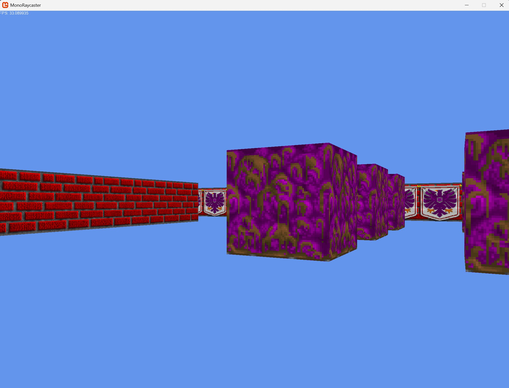
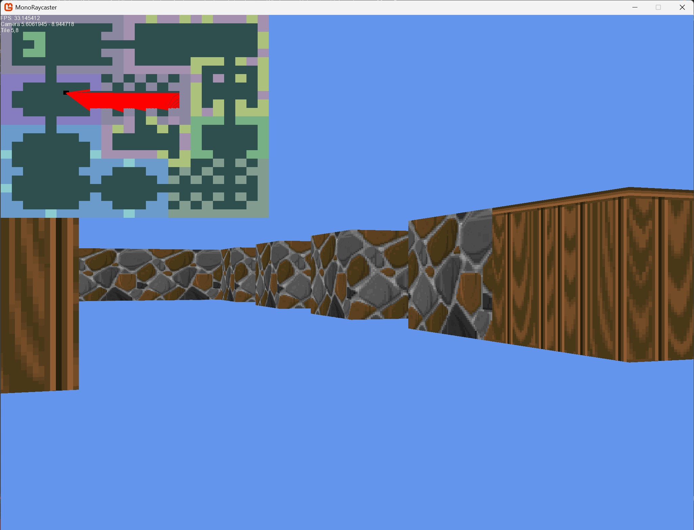

# MonoRaycaster

Simple raycaster implementation in C# using Monogame. The code is based on the well-known [article by Lode Vandevenne](https://lodev.org/cgtutor/raycasting.html).

The base implementation with no textures uses a `Color` framebuffer, rotated by 90 degrees. This allows setting the pixel data by row instead of column, avoiding expensive index calculation and inner loop.
`Span<Color>` is used to speed up data access. 

The textured implementation still renders the map rotated by 90 degrees, and applies some caching strategies to minimize I/O operations.

It is also possible to render a minimap showing the view cone:

